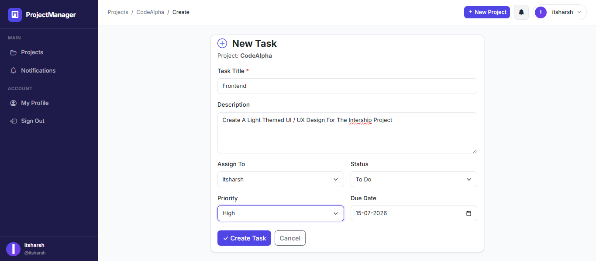

# 📋 ProjectManager — Team Project Management Tool

<div align="center">

  
  
  
  
  
  

  <br/>
  <br/>

  > A full-stack collaborative project management tool built with Django.
  > Manage projects, assign tasks, track progress, and communicate in real-time.

  <br/>

   • **[📸 Screenshots](#-screenshots)** • **[🛠 Setup](#️-local-setup)** • **[📁 Structure](#-project-structure)**

</div>

---

## ✨ Features

| Feature | Description |
|---|---|
| 🔐 **Authentication** | Register, login, logout with secure sessions |
| 📁 **Projects** | Create projects, add/remove members, manage roles |
| 📋 **Kanban Board** | Task board with To Do / In Progress / Done columns |
| 👤 **Task Assignment** | Assign tasks to members with priority and due date |
| 💬 **Comments** | Threaded commenting system inside each task |
| 🔔 **Notifications** | Live bell notifications via WebSockets (Django Channels) |
| 📱 **Responsive** | Works on mobile, tablet, and desktop |
| 🎨 **Clean UI** | Modern Indigo/Purple theme with Bootstrap 5 and Inter font |

---

## 📸 Screenshots

> _Add your screenshots here after running the project locally_

| Dashboard | Kanban Board | Task Detail |
|---|---|---|
|  |  |  |

| Login Page | Project List | Notifications |
|---|---|---|
|  |  |  |

---

## 🧱 Tech Stack

### Backend
- **Django 4.2 LTS** — Web framework
- **PostgreSQL** — Primary relational database
- **Redis** — Channel layer for WebSockets + caching
- **Django Channels 4.0** — WebSocket / async support
- **Daphne** — ASGI server for running Channels

### Frontend
- **Bootstrap 5.3** — Responsive UI components
- **Custom CSS** — Inter font, Indigo/Purple theme, fixed sidebar layout
- **Vanilla JavaScript** — WebSocket client, toast notifications, AJAX status updates

### Auth & Security
- **Django Built-in Auth** — Session-based authentication
- **python-decouple** — Environment variable management
- **CSRF protection** — On all forms (Django default)

---

## 📁 Project Structure

```
Management_CodeAlpha/
├── core/                   # Django project config
│   ├── settings.py         # All settings (reads from .env)
│   ├── urls.py             # Root URL config
│   ├── asgi.py             # ASGI entry point (Channels)
│   └── routing.py          # WebSocket routing
│
├── accounts/               # User auth + profiles
│   ├── models.py           # UserProfile model
│   ├── views.py            # Register, login, profile views
│   ├── forms.py            # Auth forms
│   ├── signals.py          # Auto-create profile on register
│   └── templates/
│
├── projects/               # Projects + members
│   ├── models.py           # Project, ProjectMember models
│   ├── views.py            # CRUD + member management
│   └── templates/
│
├── tasks/                  # Tasks + comments
│   ├── models.py           # Task, Comment models
│   ├── views.py            # Kanban board, task CRUD, AJAX status
│   └── templates/
│
├── notifications/          # Notification system
│   ├── models.py           # Notification model
│   ├── consumers.py        # WebSocket push consumer
│   └── templates/
│
├── templates/
│   └── base.html           # Master layout (sidebar + navbar)
│
├── static/
│   ├── css/style.css       # Custom Indigo/Purple theme
│   └── js/main.js          # WebSocket client + UI interactions
│
├── .env.example            # Environment variable template
├── requirements.txt        # Python dependencies
└── README.md
```

---

## ⚙️ Local Setup

### Prerequisites

Make sure you have these installed:

- Python 3.10+
- PostgreSQL 14+
- Redis 7.0+
- Git

---

### 1️⃣ Clone the Repository

```bash
git clone git@github.com:HarshDhaka69/Management_CodeAlpha.git
cd Management_CodeAlpha
```

### 2️⃣ Create Virtual Environment

```bash
# Create
python -m venv venv

# Activate — Mac/Linux
source venv/bin/activate

# Activate — Windows
venv\Scripts\activate
```

### 3️⃣ Install Dependencies

```bash
pip install -r requirements.txt
```

### 4️⃣ Set Up PostgreSQL

```bash
# Mac (Homebrew)
brew install postgresql@15
brew services start postgresql@15

# Ubuntu/Linux
sudo apt install postgresql postgresql-contrib
sudo systemctl start postgresql

# Create database
psql -U postgres
CREATE DATABASE projectmanager_db;
CREATE USER projectmanager_user WITH PASSWORD 'yourpassword';
GRANT ALL PRIVILEGES ON DATABASE projectmanager_db TO projectmanager_user;
\q
```

### 5️⃣ Set Up Redis

```bash
# Mac (Homebrew)
brew install redis
brew services start redis

# Ubuntu/Linux
sudo apt install redis-server
sudo systemctl start redis

# Test Redis is running
redis-cli ping   # Should return: PONG
```

### 6️⃣ Configure Environment Variables

```bash
# Copy the example file
cp .env.example .env

# Open and fill in your values
nano .env
```

Your `.env` file should look like:

```env
SECRET_KEY=your-very-secret-key-here
DEBUG=True
DB_NAME=projectmanager_db
DB_USER=projectmanager_user
DB_PASSWORD=yourpassword
DB_HOST=localhost
DB_PORT=5432
REDIS_URL=redis://127.0.0.1:6379
```

### 7️⃣ Run Migrations

```bash
python manage.py makemigrations accounts projects tasks notifications
python manage.py migrate
```

### 8️⃣ Create Admin Superuser

```bash
python manage.py createsuperuser
# Enter: username, email, password
```

### 9️⃣ Collect Static Files

```bash
python manage.py collectstatic --noinput
```

### 🔟 Run the Server

```bash
# Standard (no WebSockets)
python manage.py runserver

# With WebSockets (recommended)
daphne -b 0.0.0.0 -p 8000 core.asgi:application
```

Open your browser → **http://127.0.0.1:8000**

---

## 🔑 Environment Variables Reference

| Variable | Description | Example |
|---|---|---|
| `SECRET_KEY` | Django secret key | `django-insecure-xxxx` |
| `DEBUG` | Debug mode | `True` / `False` |
| `DB_NAME` | PostgreSQL database name | `projectmanager_db` |
| `DB_USER` | PostgreSQL username | `projectmanager_user` |
| `DB_PASSWORD` | PostgreSQL password | `yourpassword` |
| `DB_HOST` | Database host | `localhost` |
| `DB_PORT` | Database port | `5432` |
| `REDIS_URL` | Redis connection URL | `redis://127.0.0.1:6379` |

---

## 🚀 Git History

This project follows a clean, feature-based commit history:

```
chore: initial project setup and configuration
chore: configure Django settings with PostgreSQL and Redis
feat: add user authentication (register, login, logout, profile)
feat: add projects CRUD with member management
feat: add Kanban task board with priorities and due dates
feat: add real-time notifications with Django Channels WebSockets
feat: add responsive UI with Bootstrap 5 and custom theme
docs: add README with setup and deployment instructions
```

---

## 🔐 Security Notes

- Secret key is stored in `.env` — never committed to GitHub
- All views protected with `@login_required`
- Project data only accessible to verified project members
- Owner/admin checks enforced for destructive actions
- CSRF tokens on every form (Django default)
- Password hashing handled by Django's built-in system

---

## 🧑‍💻 Author

**Harsh Dhaka**
- GitHub: [@HarshDhaka69](https://github.com/HarshDhaka69)
- Internship: CodeAlpha — Task 3

---

## 📄 License

This project is licensed under the **MIT License**.
Feel free to use, modify, and distribute with credit.

---

<div align="center">
  Made with ❤️ during CodeAlpha Internship
</div>
